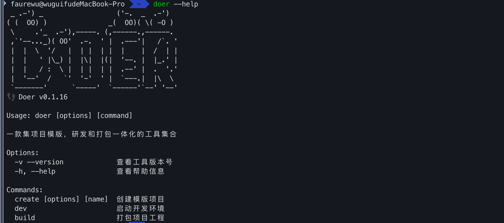
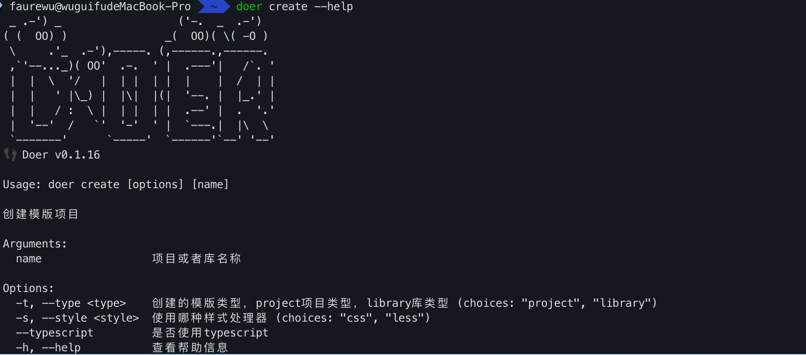

import Tabs from '@theme/Tabs';
import TabItem from '@theme/TabItem';

# 命令行

本文档将会介绍所有常用的Doer Cli命令

## 查看命令帮助信息

```bash
$ doer --help
```



## 创建新项目

### 查看创建命令帮助信息

```bash
$ doer create --help
```



### 创建项目

```bash
$ doer create
```

可以根据自己的需要添加参数和选项，或者直接通过交互式命令行创建项目

## 项目开发

```bash
$ doer dev
```

该命令已经集成在创建项目的package.json文件中，可直接执行
  
<Tabs>
  <TabItem value="npm" label="npm">
  ```bash
  $ npm run dev
  ```
  </TabItem>
  <TabItem value="yarn" label="yarn">
  ```bash
  $ yarn dev
  ```
  </TabItem>                                                                                                                                                                                                                                                                                                                           
  <TabItem value="pnpm" label="pnpm">
  ```bash
  $ pnpm run dev
  ```
  </TabItem>
</Tabs>

## 项目打包

```bash
$ doer build
```

该命令已经集成在创建项目的package.json文件中，可直接执行
  
<Tabs>
  <TabItem value="npm" label="npm">
  ```bash
  $ npm run build
  ```
  </TabItem>
  <TabItem value="yarn" label="yarn">
  ```bash
  $ yarn build
  ```
  </TabItem>                                                                                                                                                                                                                                                                                                                           
  <TabItem value="pnpm" label="pnpm">
  ```bash
  $ pnpm run build
  ```
  </TabItem>
</Tabs>